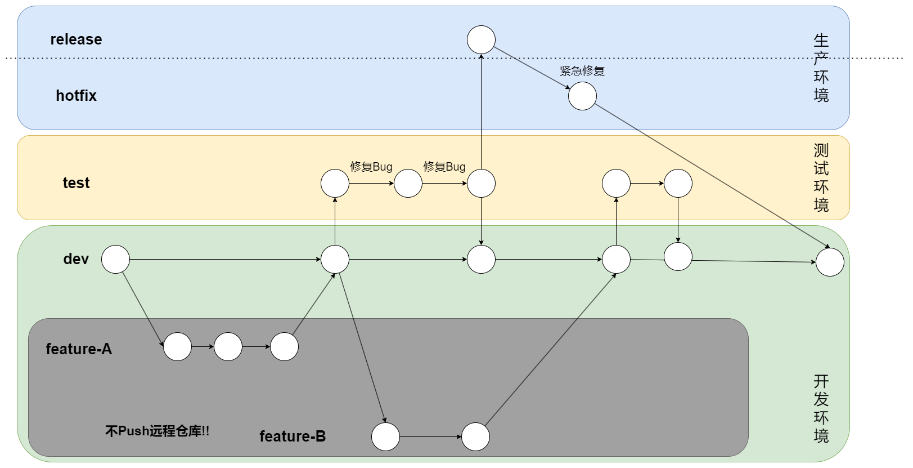

在日常开发中能够发现，许多的Bug都是由于连带反应而导致的Bug，包括一些以前已经验证过的功能。并且一个程序员日常的工作内容包括：开发、修复Bug，甚至有运维管理、发布等工作。在开发中就遇到过开发A模块功能，开发中途又遇到一些测试环境的bug需要修复，如果都在一个版本发布，对于问题的追溯或者一些模块的开发会处于一个混沌不清的状态。
采用Git-flow规范能够让这些开发过程中的需求、模块开发、bug修复互不干扰。

**以下是本人的习惯，仅供参考**
---

dev分支：开发分支，最主干的分支。 `projectname-dev` 

feature分支：需求开发分支，主要是负责有一个新的需求做开发的时候创立的分支，只在本地git环境存在，不允许push。`projectname-feature` 

test分支：测试分支，部署到测试环境，用于给测试工程师做测试，可在这个分支上做修复。`projectname-test`

release分支：发布分支，发布到正式环境。`projectname-release`

**注意事项**
1. release分支只能由test分支push出，test分支只能由dev分支push出
2. featur分支不需要在远程库
   